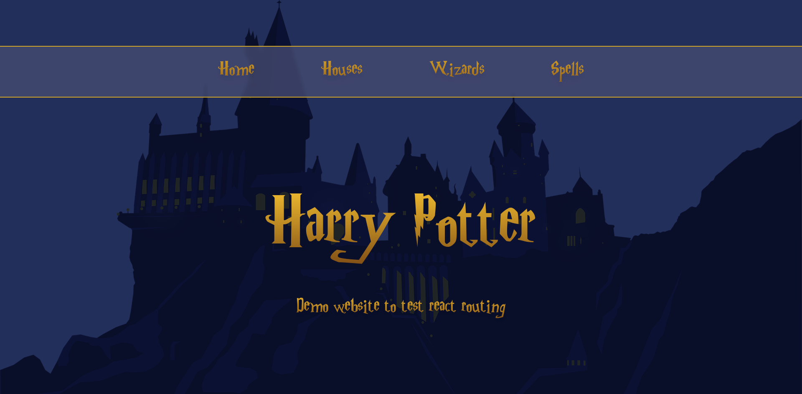

# Harry Potter API - React Routing Dom

Simple website created with the aim of testing the basics of React Routing Dom.

### You can have a look at the result <a href='https://budy6991.github.io/harry-potter-routing-demo'>here </a>

For the color palette, custom clases in Tailwind CSS were implemented, as well as for the logos of the houses.

You can also check the API, that was taken from <a href="https://wizard-world-api.herokuapp.com/swagger/index.html">this Website</a>
